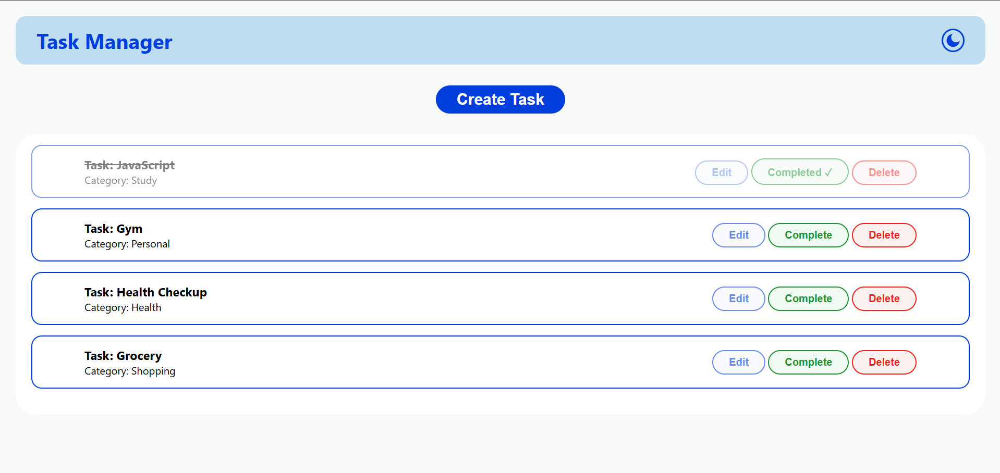

# Assignment 1 - Task Manager 
This Website is created using HTML and CSS and JavaScript using DOM Manipulation

## 🚀 Live Demo
https://task-manager-mantu-kr-tiwari.vercel.app/

## 🖼 Desktop Preview

# 📋 Task Manager

A simple **Task Manager** built using **HTML, CSS, and JavaScript**. This project demonstrates CRUD operations, DOM manipulation, event handling, search functionality, and dark mode.

## ✨ Features

* ➕ Create Task
* ✏️ Edit Task
* ✅ Complete Task
* 🗑️ Delete Task
* 🌙 Dark Mode

## 🛠️ Tech Stack

* HTML5
* CSS3
* JavaScript (ES6)

---

# Browser Concepts

### Parsing

The browser reads the HTML code and converts it into a structured document.

### Tokenization

HTML is broken into small tokens (tags, attributes, text) before parsing.

### DOM Tree

The browser creates a tree structure of HTML elements, allowing JavaScript to access and modify them.

### CSSOM Tree

The browser parses CSS and creates a tree of all styling rules.

### Render Tree

The DOM and CSSOM combine to form the Render Tree, which is used to display the webpage.

### Event Bubbling

Events travel from the target element up to its parent elements.

### Event Capturing

Events travel from the outermost parent down to the target element.

### Event Delegation

A single event listener on a parent element handles events from dynamically created child elements using event bubbling.

---

## 📚 What I Learned

* DOM Manipulation
* CRUD Operations
* Dynamic UI Rendering
* Form Validation
* Event Handling
* Array Methods (`push`, `splice`, `find`, `filter`)
* Dark Mode Implementation

---

## 👨‍💻 Author

**Mantu Kumar Tiwari**
